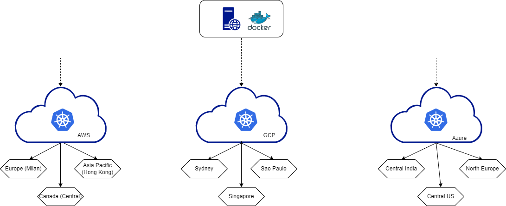
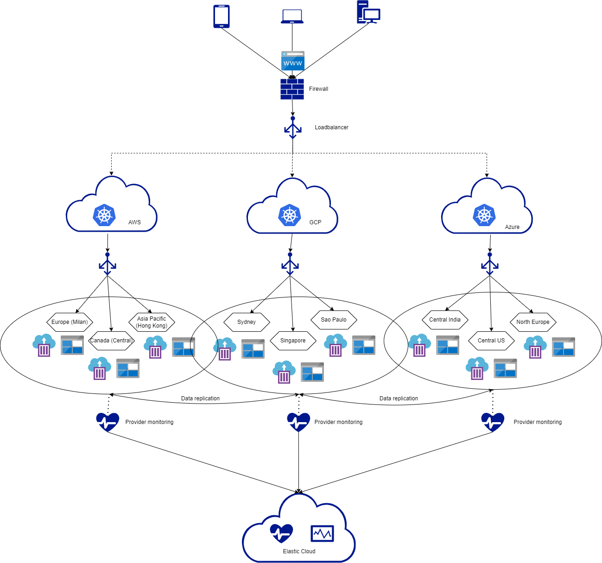

# Deploying docker webserver to multicloud

In order to deploy a system to multiple regions with different cloud providers, there needs to be a clear cut strategy for implementing this.
Say that we have a need to deploy to AWS, Google Cloud and Azure to ensure low latency across the world.

A method that has been tested and proven to be most feasible when doing this, would be to use terraform.
[Terraform](https://www.terraform.io/) is a tool in which you can manage external resources with code. (IaC)

Another feasible way would be to use [Spinnaker](https://spinnaker.io/), an open source multi-cloud continous delivery platform created by Netflix.
One of the pros on using Spinnaker means that you also have the opportunity to make use of [Netflix's Chaos Monkey](https://netflix.github.io/chaosmonkey/) in order to continuously 
test the infrastructure by randomly terminating instances in production, so engineers are forced to ensure resiliency towards instance failures.

Challenges could lie in how the different providers can't easily interconnect.

# Adding Data Persistence to the above setup

Adding data persistence to the above brings forth a couple of questions needed answered. The why is important, as to why do we need data persistence.
What does the feature do, is it handling user upload of videos or images that needs to be available on all regions in all cloud providers. Then we might need to look
at setting up data replication from the different providers. Depending on what data is handled, it also begs the question on what kind of storage is needed. Could it be handled by a file share with SMB for connection or an S3.
Does the data persistence need to be separated, such as the deployed web server has different needs in different regions. Does it has to handle different data laws in different countries and not be persisted across regions, but persisted from nearest region from one cloud provider to the nearest region of another cloud provider.

There needs to be a clear cut purpose for why a feature adding data persistance to this setup is needed. Then you could start discussing the possible outcome of how to solve this.

# Traffic is increasing on the setup, how to scale

There are multiple ways to ensure scaling. Firstly make sure to have setup proper load balancing that can handle multi cloud and also that loadbalancing is setup on the different providers. Also make sure that horizontal Pod autoscaling is enabled on the clusters on where we are deploying and setting up and autoscale for the deployment. Then on each of the cloud providers we need to setup Auto Scaling for handling horizontal scaling for spreading out the load on more nodes and if needed vertical scaling for the nodes.

Challenges could lie in setting up the correct way to scale in order of costeffectiveness and when to do so. Especially since it will be across multiple providers.

# Understanding and monitoring performance on the system

The biggest hurdle on monitoring how the system performs, is that the different cloud providers has tools that can only monitor their own infrastructure and can't give a consolidated view of how the system performs across the providers. There is also a difference in apis, that makes it difficult to get a one size fits all tool.
A good bet would be to try and go for elastics cloud monitoring tool in order to give the bigger overview and also setup a place to store logs for monitoring.
Other than that, make good use of the inherent tools on the providers and set similar warnings in place for more pressing needs.

# Solution Proposal

As a first draft proposal on how to solve the above mentioned in an attempt to deploy to multiple cloud providers in different regions with data persistence, scaling and monitoring I will try to give a step-by-step draft.

## Prerequisites
In order to go through the solution proposal, the following is needed
* Accounts on the different cloud providers
* Accounts configured for terraform.
* Access to build/deploy system like azure pipelines for deployment

## Infrastructure plan

This is a highlevel diagram of the idea behind the deployment

